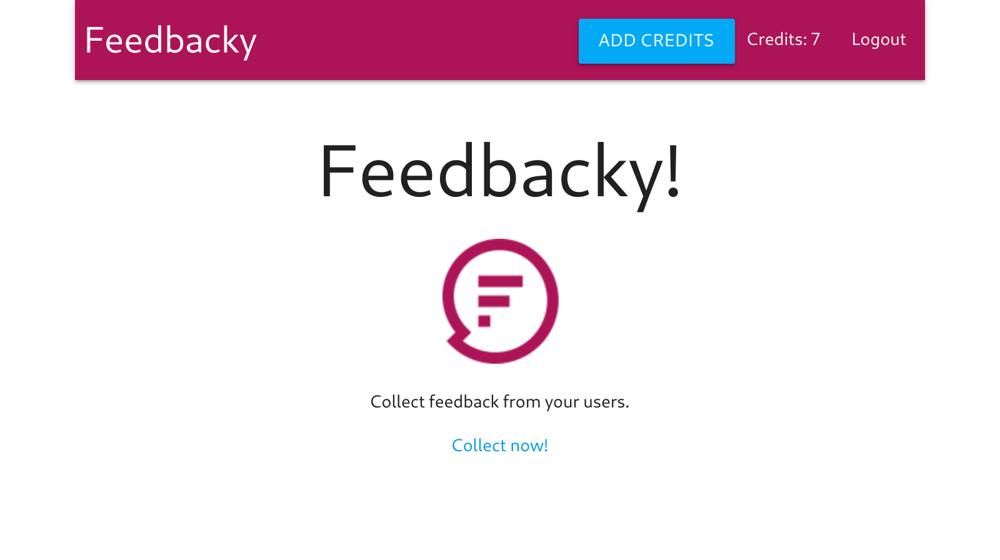

<p align="left"></p>

> Node.js, Express.js and React.js app that allows you to send out emails to collect feedback

## Tech Stack

**Built with**

- [Node.js](https://nodejs.org) with [Express layer](https://expressjs.com/)
- [React.js](https://reactjs.org/) & [React Redux](https://react-redux.js.org/)
- [Redux Form](https://redux-form.com)
- [Ramda.js](https://ramdajs.com/)
- MongoDB with [MongoDB Atlas](https://www.mongodb.com/cloud/atlas)
- authentication with [Google Auth 2.0](https://developers.google.com/identity/protocols/OAuth2)
- [Materialize CSS](https://materializecss.com/)
- [Stripe](https://stripe.com/)
- [SendGrid](https://sendgrid.com/)
- [Heroku](https://heroku.com)

## Features

This is a toy app that allows you to make fake payments with Stripe and send out simple email surveys with SendGrid.

The app was coded with the help of [Stephen Grider's](https://github.com/StephenGrider) Udemy course [Node with React: FullStack Web Development](https://www.udemy.com/node-with-react-fullstack-web-development).

Differences/enhancements over the course:

- uses [Passport-Next fork](https://github.com/passport-next/passport) and [Passport-Next Google OAuth 2.0 Strategy](https://github.com/passport-next/passport-google-oauth2) instead of the stale upstream repositories (and deprecated G+ auth)
- additional error handling with try/catch for Redux actions
- conditional rendering on the homepage depending on authentication
- protected routes if user is not authenticated
- credits validation (checks if user has credits in their account before showing a new survey form)
- 404 page and client-side "catch-all" routing
- ability to delete surveys
- Metro UI color scheme
- uses Ramda.js instead of Lodash.js




## How to Use

Navigate to [https://feed-backy.herokuapp.com/](https://feed-backy.herokuapp.com/) and log in with your Google Account.

You can add credits via Stripe with fake credentials. Click on the blue "ADD CREDITS" button and fill in the pop-up window.  
Insert a dummy email. The card number is:

```
4242 4242 4242 4242
```

Month/Year and CVS: add dummy numbers. Then "pay" \$5.

On the main page of the app, click on "Collect now" and create a fake survey.

The survey will be send via SendGrid and users can click on "yes" or "no". You can see these in your dashboard.

### Deployment

See [Getting Started on Heroku with Node.js](https://devcenter.heroku.com/articles/getting-started-with-nodejs): `git push heroku master`.

## Licence

Code is copyright © 2019 Stephen Grider & Sophia Brandt.
